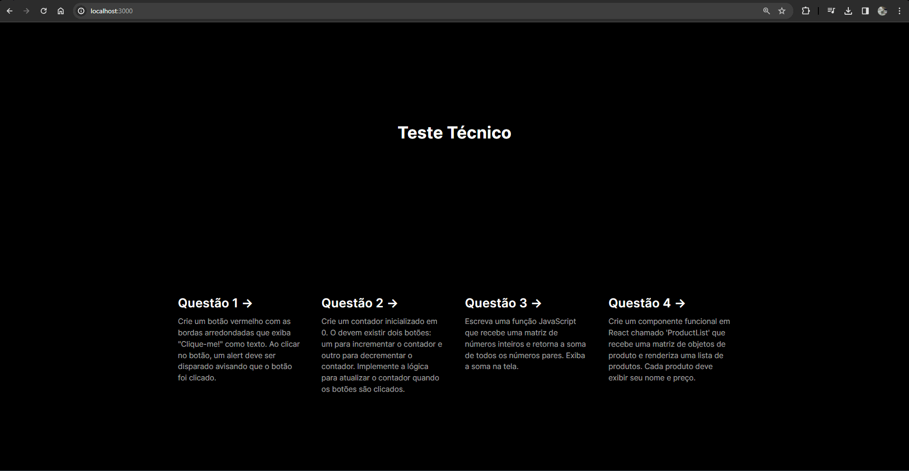
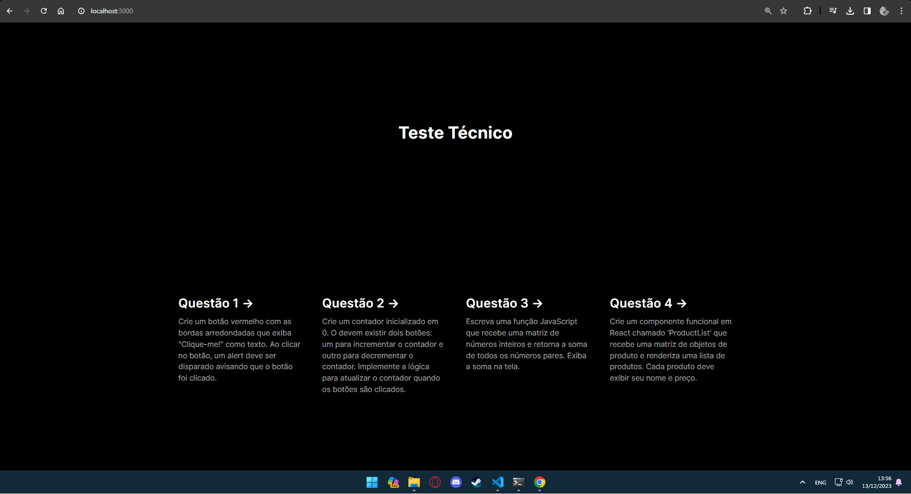
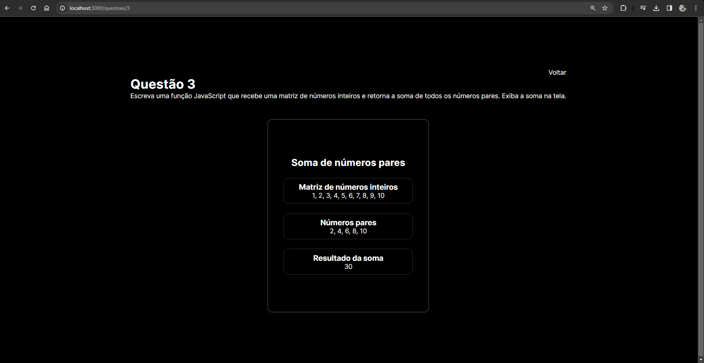

# Teste Técnico em Desenvolvimento Web - React

# Autor

Jonas Miranda

## Como utilizar

Para iniciar o projeto, deverá ser executado:

### `npm install`

### `npm run dev`

Inicia o app em modo desenvolvedor

## Tecnologias utilizadas

        

### Questão 1:

Para este desafio foi criado um botão genérico que recebe uma ação para ser ativada no onClick e um texto, essa gereralização foi criada pensando na possibilidade de reaproveitar o mesmo em outros componentes, também foi adicionado um hover que é ativado quando o mouse passa pelo botão e uma ação de ativar um alert, demonstrando a manipulação de eventos do navegador.

**Arquivo:** [Questão 1](./src/app/questoes/1/page.jsx)

### Questão 2:

Neste desafio foi implementado um contador de acordo com o solicitado no desafio, iniciando em zero, porém ao carregar a tela o estado do contador deverá ser atualizado para 10. foram usados princípios básicos de programação para incrementar e decrementar e foram utilizados também os hooks (useState e useEffect) do react para realizar a lógica.

**Arquivo:** [Questão 2](./src/app/questoes/2/page.jsx)

### Questão 3:

Nesta questão foi necessário criar uma função em JavaScript que recebe os números da matriz e realiza os cálculos necessários para o algoritmo funcionar. Também foi criado um componente para melhorar a experiência do usuário.

**Arquivo:** [Questão 3](./src/app/questoes/3/page.jsx)

### Questão 4:

Para este desafio foi criado um componente que recebe a lista de produtos e renderiza todas as informações de acordo com o especificado, foram utilizados os conceitos: "map" para a lógica de renderização, "props" para passar informações do componente pai para o componente filho e também foi utilizado um grid layout para mostrar os produtos.

**Arquivo:** [Questão 4](./src/app/questoes/4/page.jsx)

### Referências

Documentação React: https://pt-br.legacy.reactjs.org/docs/getting-started.html

Documentação Css: https://developer.mozilla.org/pt-BR/docs/Web/CSS

Documentação Html: https://developer.mozilla.org/pt-BR/docs/Web/HTML/Element/html

Padrões de commit: https://github.com/iuricode/padroes-de-commits
